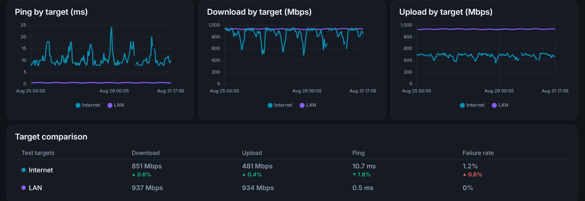
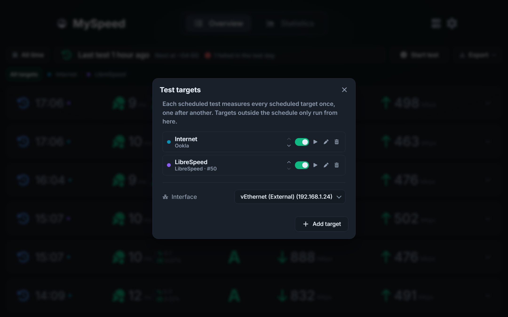

[![Contributors][contributors-shield]][contributors-url]
[![Forks][forks-shield]][forks-url]
[![Stargazers][stars-shield]][stars-url]
[![Issues][issues-shield]][issues-url]
[![MIT License][license-shield]][license-url]
[![Release][release-shield]][release-url]

<br />
<div align="center">
  <a href="https://github.com/i7Gamer/MySpeed">
    
  </a>
  <h3>MySpeed <a href="README.de.md">🇩🇪</a> <a href="README.md">🇺🇸</a></h3>
</div>


## 🤔 What is MySpeed?

MySpeed is a speed test analysis software that records your internet speed over a fully configurable retention period.

### ⭐ Features

- 📊 MySpeed generates clear statistics on speed, ping, and more
- ⏰ MySpeed automates speed tests and allows you to set the time between tests using Cron expressions
- 🗄️ Add multiple servers directly to a MySpeed instance
- 🩺 Configure health checks to notify you via email, Signal, WhatsApp, or Telegram in case of errors or downtime
- 📆 Test results can be stored for any retention period you configure - from a few days to forever
- 🔥 Support for Prometheus and Grafana
- 🗳️ Choose between Ookla, LibreSpeed, Cloudflare and your own iperf3 server
- 🎯 Measure against several targets in one round - the internet and your own LAN, side by side
- 📉 Get alerted when a target falls below what it usually delivers, measured against its own rolling median
- 🛰️ Trace the route to the test server when a test fails or slows down, and see hop by hop where the line broke
- 🔑 Let a script or Home Assistant start a test with a revocable API token instead of the password
- 🔀 Keep a log of when your external IP or your provider changed, and get told when it happens

### ⬇️ Installation

The native builds bind the speed test to your real network interface. Docker only
does that with host networking on a Linux host — anywhere else it measures the path
through Docker's network stack rather than your line.

#### 🐧 Linux (binary)

Download a Linux binary from the [releases page](https://github.com/i7Gamer/MySpeed/releases/latest):

- `MySpeed-linux-x64` — default Bun target (needs **AVX2**)
- `MySpeed-linux-x64-baseline` — older x86_64 CPUs without AVX2 (SSE4.2 / Nehalem+)
- `MySpeed-linux-arm64` — aarch64

If the default binary exits immediately with `Illegal instruction` / `SIGILL`, use the
baseline build. The install script picks baseline automatically when `/proc/cpuinfo`
has no `avx2` flag.

```bash
curl -sSL -o /tmp/myspeed-install.sh \
  https://github.com/i7Gamer/MySpeed/releases/latest/download/install.sh
sudo bash /tmp/myspeed-install.sh
```

The installer verifies the download against the release's `SHA256SUMS` before it
installs anything. If you would rather be asked which of the two installations to
run, `chooser.sh` at the same address puts the question first.

Building a Linux binary yourself (`bun run build:binary:baseline`) has to happen *on*
Linux — a container is fine. Cross-compiling from macOS or Windows embeds the host's
native addons (e.g. `@resvg/resvg-js`), producing a binary that starts and then fails
at runtime.

#### 🪟 Windows

Download from the [releases page](https://github.com/i7Gamer/MySpeed/releases/latest):

- `MySpeed-windows-x64.exe` — default Bun target (needs **AVX2**)
- `MySpeed-windows-x64-baseline.exe` — older x86_64 CPUs without AVX2 (SSE4.2 / Nehalem+)
- `MySpeed-installer.msi` and `MySpeed-installer-baseline.msi` — the same two as an
  installer, which registers MySpeed as a Windows service

Nothing picks the right one for you here, so go by the symptom: the exe exits
immediately with `Illegal instruction`, and the MSI installs cleanly but leaves a
service that never starts. Either one means the baseline build. To check before
downloading, PowerShell 7 answers it with
`[System.Runtime.Intrinsics.X86.Avx2]::IsSupported`.

The two installers are one product, so running the other one switches the build and
keeps your database.

The exe keeps its data in a `data` folder next to the directory you start it from, so
run it from the folder you want that data to live in. The MSI installs to
`C:\Program Files\MySpeed` and keeps its data in `C:\ProgramData\MySpeed` instead.

#### 🐳 Docker

```bash
docker run -d -p 5216:5216 -v myspeed:/myspeed/data --restart=unless-stopped --name MySpeed i7gamer/myspeed
```

Or with Compose:

```yaml
services:
  myspeed:
    image: i7gamer/myspeed
    container_name: MySpeed
    restart: unless-stopped
    ports:
      - "5216:5216"
    volumes:
      - myspeed:/myspeed/data

volumes:
  myspeed:
```

##### ⚡ Getting the full line speed

On a Linux host, add `--network host` (Compose: `network_mode: host`) and drop the
port mapping:

```bash
docker run -d --network host -v myspeed:/myspeed/data --restart=unless-stopped --name MySpeed i7gamer/myspeed
```

MySpeed binds the speed test to a specific network interface. On the default bridge
network the only interface a container can see is its own `eth0`, so every test is
forced through Docker's NAT and measures that path rather than your line - the faster
your connection, the more it costs you. Host networking lets MySpeed bind to the real
NIC, and the interface picker in the settings starts listing your actual interfaces.

MySpeed still listens on port 5216, now directly on the host. This has no effect on
Docker Desktop for Windows and macOS, where the traffic goes through a VM either way.

The route trace (switched on under *Optimal values*) uses the operating system's own tool: `tracert` on Windows, `traceroute` on macOS and Linux. The Docker image ships `tracepath` instead, because `traceroute` needs a raw socket and the container runs as an unprivileged user; on a bare Linux install, either one on the `PATH` is used.

#### 🔧 From source

<details>
<summary><strong>Build and run it yourself</strong> — the binaries above are this, already built</summary>

Requires [bun](https://bun.sh).

```bash
git clone https://github.com/i7Gamer/MySpeed.git
cd MySpeed
bun install
cd client && bun install && cd ..
bun run build
node scripts/move-client-build.js
bun run server/index.js
```

The client has its own dependencies, and the server serves the interface from `build/` at the repository root, which is where the last step moves it.

MySpeed then listens on **http://localhost:5216**.

</details>

### 🔐 Exposing MySpeed to the internet

MySpeed is safe to run on a trusted LAN out of the box. Putting it on a public
address takes a few deliberate steps.

<details>
<summary><strong>Read the guide</strong> — first run, password recovery, reverse proxy, environment variables, and what is protected</summary>

#### First run

A fresh instance has no password. Requests from other machines are refused until
one is set, so the first thing MySpeed prints on startup is a one-time **setup
token**:

```
  Setup token: 5f3c1e...
```

Enter it when the interface asks for a password, then set a real password from
the dropdown menu. A new token is issued on every restart and is never written to
disk. On a network you fully trust you can skip this with `ALLOW_NO_PASSWORD=true`
— on a public address, don't.

Behind Authelia, Authentik or another forward-auth proxy, sign-in can be
delegated to the proxy entirely: set `TRUSTED_AUTH_HEADER` and
`TRUSTED_AUTH_PROXIES` from the table below and the login prompt never appears.

#### If the password no longer works

The setup token only applies to an instance that has *no* password, so it is no
help once one is set — and neither is loopback access nor `ALLOW_NO_PASSWORD`.
A password that is set but not known is cleared from the command line:

```bash
MySpeed --reset-password
```

The Docker image ships the runtime and the server sources rather than a compiled
binary, so run the entry point there instead:

```bash
docker exec -u bun <container> bun server/index.js --reset-password
```

Run it from the same directory the server runs in — it resolves
`data/storage.db` relative to the working directory, and will say so if it finds
no configuration there. In the container that is already the working directory.

The instance is then back to the first-run state above: open on the machine it
runs on, asking every other machine for a setup token, which it prints to its log
as it turns the next request away. Nothing needs restarting; set a new password
from the dropdown menu. Sessions already signed in stay valid until they expire —
restart the server to end them.

The command says what happened in words, and exits with a code for when something
else is reading:

| Code | Meaning | What to do |
| --- | --- | --- |
| `0` | The password was cleared, or there was none to clear. | Set a new one from the interface. |
| `111` | The database could not be opened at all. | Check that the data directory exists and is writable by the user the server runs as. |
| `113` | The database opened and holds no MySpeed configuration. | Nothing was changed. The data is elsewhere — run the command from the directory the server runs in. |
| `114` | The configuration is there and the write did not go through. | **The password is unchanged and you are still locked out.** The path is right; check that the database is not locked by another process and that the directory is writable. |

#### Starting a test from outside

A script, a router hook or Home Assistant can start a test without holding the admin password. Create a token under *Settings → API tokens* - it is shown once - and send it as a Bearer header:

```bash
curl -X POST -H "Authorization: Bearer msp_..." https://myspeed.example.org/api/speedtests/run
```

A token can start a test and read `GET /api/speedtests/status/live` to follow it, and nothing else. Revoke it from the same dialog. For Home Assistant, a `rest_command` does the same:

```yaml
rest_command:
  myspeed_test:
    url: https://myspeed.example.org/api/speedtests/run
    method: POST
    headers:
      Authorization: "Bearer msp_..."
```

Tokens travel in a configuration export only when it includes the secrets, the way node passwords do; a redacted export leaves them out and restoring it leaves them alone.

#### Connection changes

Every Ookla, LibreSpeed and Cloudflare test records the external address the provider saw, and Ookla and LibreSpeed record the provider's name. When either differs from the previous test, MySpeed writes the change to a log you can read under *Settings → Connection changes*, and every notifier offers a switch to be told about it - Discord, Telegram, email, Gotify, ntfy, Pushover and the webhook, which posts it as an `IP_CHANGED` event. Each target is compared only with its own earlier tests, so two targets on two WAN links do not read each other's address as a change. IPv4 and IPv6 are followed separately, so a dual-stack line that answers one test over each does not count as a change, and a provider's name is compared only with what the same provider said before. The message template may use `%ip%`, `%previousIp%`, `%isp%`, `%previousIsp%` and `%connectionChanges%`, which spells out only what changed. The log is kept apart from the tests but forgotten with them: the retention setting prunes it by the same cutoff, and clearing the history or a factory reset clears it too. It is not part of a configuration export.

#### Outages

A single failed test already reaches every notifier that asked for failures, and on a flaky provider that is a message about nothing. Every notifier also offers a switch to be told once when a target has failed a number of tests in a row - two unless you type another number beside the switch - and once more when the first test after that succeeds. Both are edges: the outage is announced on the one failure that makes the streak exactly that long, and the recovery on the first success after a streak at least that long, so a notifier set to three hears nothing about a two-failure blip at either end. The streak is read from the stored rows, so a restart in the middle of an outage does not announce it twice. The webhook posts the two as `OUTAGE_STARTED` and `CONNECTION_RESTORED`; the templates may use `%failuresInRow%`, `%downSince%`, `%downtimeMinutes%` and `%outageSummary%`, which says how many tests failed and since when, on the instance's own clock. A target that opted out of alerting stays quiet about this too.

#### Put a reverse proxy in front

This is the supported way to expose MySpeed. The proxy terminates TLS and, ideally,
authenticates before MySpeed is reached at all:

```nginx
server {
    listen 443 ssl;
    server_name speed.example.com;

    ssl_certificate     /etc/letsencrypt/live/speed.example.com/fullchain.pem;
    ssl_certificate_key /etc/letsencrypt/live/speed.example.com/privkey.pem;

    location / {
        proxy_pass http://127.0.0.1:5216;
        proxy_set_header Host              $host;
        proxy_set_header X-Real-IP         $remote_addr;
        proxy_set_header X-Forwarded-For   $proxy_add_x_forwarded_for;
        proxy_set_header X-Forwarded-Proto $scheme;
    }
}
```

Then tell MySpeed the proxy is there, or every client will look like one address
and a single attacker can lock everybody out of the login throttle:

```bash
docker run -d -p 127.0.0.1:5216:5216 -e TRUST_PROXY=1 \
  -v myspeed:/myspeed/data --restart=unless-stopped --name MySpeed i7gamer/myspeed
```

Binding the published port to `127.0.0.1` keeps the container reachable only
through the proxy.

#### Environment variables

The full list the server reads — including database and preview/testing variables not shown here — is in [`.env.example`](.env.example) at the repository root, with defaults and a one-line purpose for each.

| Variable | Default | What it does |
| --- | --- | --- |
| `TRUST_PROXY` | unset | Number of proxies in front (`1`) or a preset such as `loopback`. Required behind a reverse proxy so rate limiting sees real client addresses. `true` is read as `1`: Express would otherwise take the address from a header the caller writes. |
| `BASE_PATH` | unset | Serve the whole application from a subdirectory - `/internet_speed` - for a proxy that routes on a path prefix without stripping it off. The client works the prefix out for itself, so this is the only setting involved. |
| `ALLOW_NO_PASSWORD` | `false` | Serve an instance that has no password to anyone who can reach it. LAN only. |
| `TRUSTED_AUTH_HEADER` | unset | Accept a reverse proxy's sign-in instead of asking for the password: requests carrying this header — `Remote-User` for Authelia and Authentik — are admitted as the operator. Only works together with `TRUSTED_AUTH_PROXIES`, and the proxy must strip the header from incoming requests, which forward-auth middlewares do by default. |
| `TRUSTED_AUTH_PROXIES` | unset | The only addresses allowed to assert that header: comma-separated addresses and subnets — `172.18.0.5,10.0.0.0/8`. Checked against the connecting socket, never against a forwarded header. Without it, header authentication stays off. |
| `FRAME_ANCESTORS` | `'none'` | CSP origins allowed to embed MySpeed in an iframe, for dashboards like Homepage or Heimdall. |
| `HTTPS_REDIRECT` | `true` | Send network callers to the HTTPS listener when `data/certs` holds a certificate. Set `false` if a proxy terminates TLS and `TRUST_PROXY` is not set. |
| `ALLOW_LOCAL_NODES` | `false` | Permit remote nodes on loopback or link-local addresses. Off by default so a node URL cannot be used to probe the host. |
| `ALLOWED_NODE_HOSTS` | unset | Restrict remote nodes to these hosts, comma-separated, each with an optional port — `192.168.1.50,myspeed.example.net:5216,[fd00::1]`. Unset permits any host outside the blocked ranges. Worth setting on an instance reachable from the internet. |

#### What is protected, and what is not

Built in: the login throttle and per-endpoint rate limits, a 100 KB request body
cap outside the two import endpoints, CSP and anti-framing headers, node URLs
blocked from reaching loopback and cloud metadata addresses, and a config export
that redacts credentials unless you add `?includeSecrets=true`.

Still worth knowing: the password is held in the browser's `localStorage` and sent
on every request, so anyone with access to the browser profile has it. There is a
single shared password rather than per-user accounts. Secrets are stored
unencrypted in `data/storage.db` — back that file up as carefully as you would a
password manager export.

</details>

### 📸 Example Screenshots

#### Homepage (List View)


#### Homepage (Statistics View)


#### Target Comparison



#### Test Targets



#### Page During a Speed Test


## License

Distributed under the MIT license. See `LICENSE` for more information.

[contributors-shield]: https://img.shields.io/github/contributors/i7Gamer/MySpeed.svg?style=for-the-badge

[contributors-url]: https://github.com/i7Gamer/MySpeed/graphs/contributors

[forks-shield]: https://img.shields.io/github/forks/i7Gamer/MySpeed.svg?style=for-the-badge

[forks-url]: https://github.com/i7Gamer/MySpeed/network/members

[stars-shield]: https://img.shields.io/github/stars/i7Gamer/MySpeed.svg?style=for-the-badge

[stars-url]: https://github.com/i7Gamer/MySpeed/stargazers

[issues-shield]: https://img.shields.io/github/issues/i7Gamer/MySpeed.svg?style=for-the-badge

[issues-url]: https://github.com/i7Gamer/MySpeed/issues

[license-shield]: https://img.shields.io/github/license/i7Gamer/MySpeed.svg?style=for-the-badge

[license-url]: https://github.com/i7Gamer/MySpeed/blob/master/LICENSE

[release-shield]: https://img.shields.io/github/v/release/i7Gamer/MySpeed.svg?style=for-the-badge

[release-url]: https://github.com/i7Gamer/MySpeed/releases/latest
