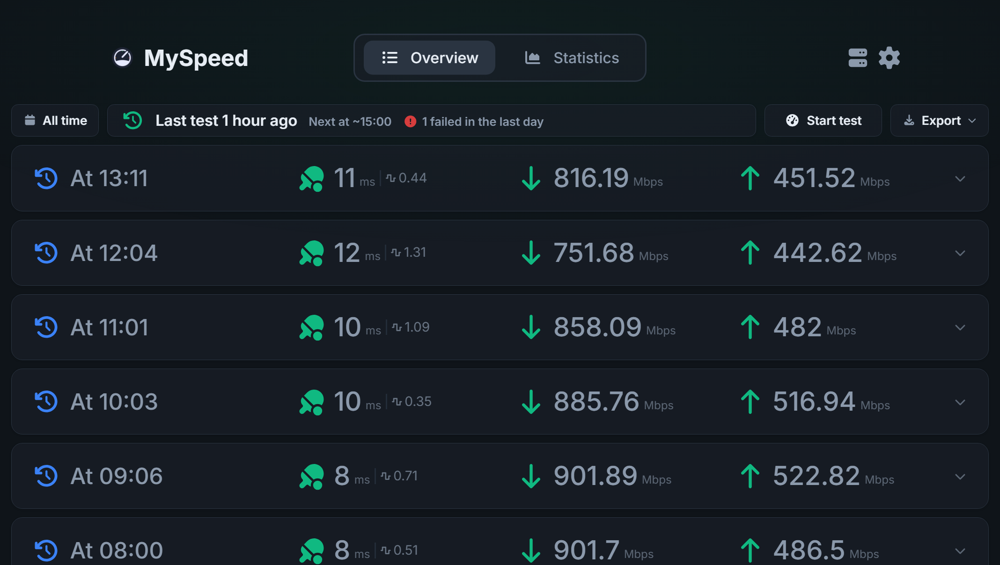
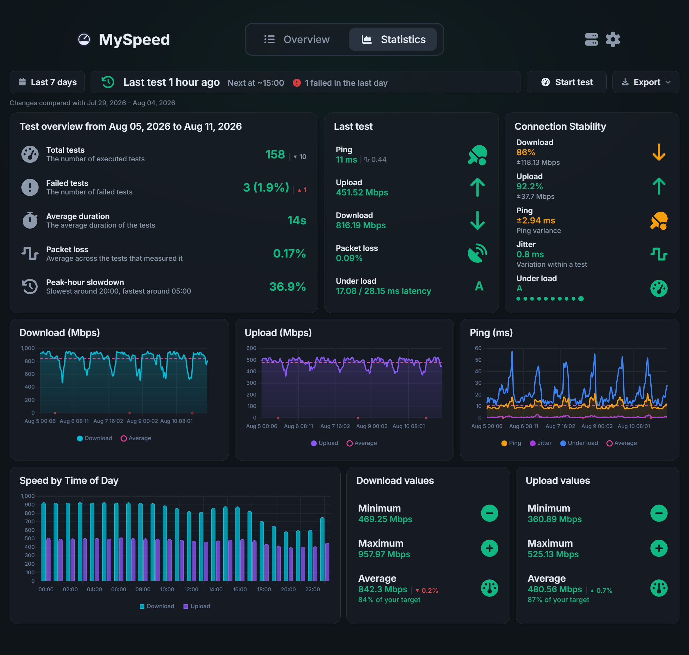
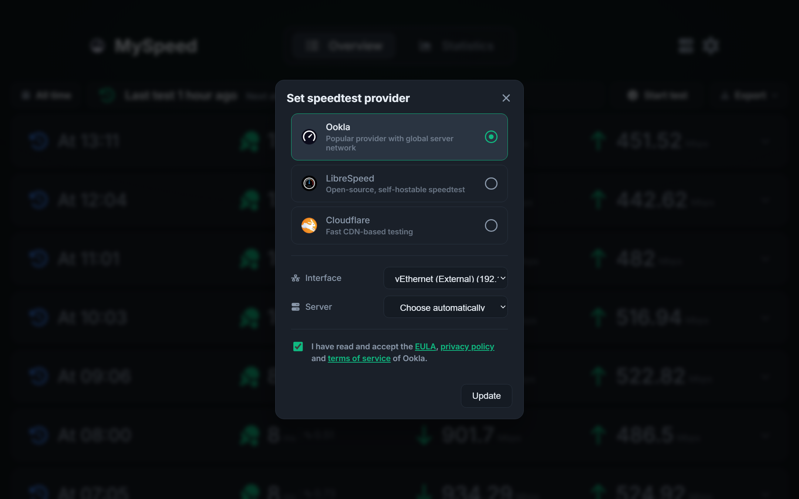
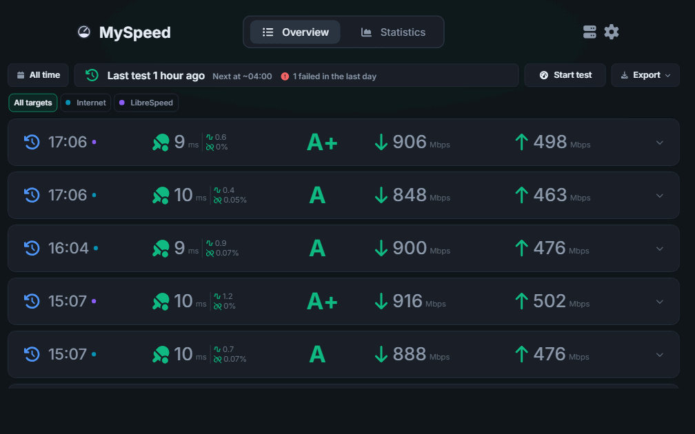

[![Contributors][contributors-shield]][contributors-url]
[![Forks][forks-shield]][forks-url]
[![Stargazers][stars-shield]][stars-url]
[![Issues][issues-shield]][issues-url]
[![MIT License][license-shield]][license-url]
[![Release][release-shield]][release-url]

<br />
<div align="center">
  <a href="https://github.com/i7Gamer/MySpeed">
    
  </a>
  <h3>MySpeed <a href="README.de.md">🇩🇪</a> <a href="README.md">🇺🇸</a></h3>
</div>


## 🤔 What is MySpeed?

MySpeed is a speed test analysis software that records your internet speed over a fully configurable retention period.

### ⭐ Features

- 📊 MySpeed generates clear statistics on speed, ping, and more
- ⏰ MySpeed automates speed tests and allows you to set the time between tests using Cron expressions
- 🗄️ Add multiple servers directly to a MySpeed instance
- 🩺 Configure health checks to notify you via email, Signal, WhatsApp, or Telegram in case of errors or downtime
- 📆 Test results can be stored for any retention period you configure - from a few days to forever
- 🔥 Support for Prometheus and Grafana
- 🗳️ Choose between Ookla, LibreSpeed and Cloudflare speed test servers
### ⬇️ Installation

#### 🐳 Docker (recommended)

```bash
docker run -d -p 5216:5216 -v myspeed:/myspeed/data --restart=unless-stopped --name MySpeed i7gamer/myspeed
```

Or with Compose:

```yaml
services:
  myspeed:
    image: i7gamer/myspeed
    container_name: MySpeed
    restart: unless-stopped
    ports:
      - "5216:5216"
    volumes:
      - myspeed:/myspeed/data

volumes:
  myspeed:
```

##### ⚡ Getting the full line speed

On a Linux host, add `--network host` (Compose: `network_mode: host`) and drop the
port mapping:

```bash
docker run -d --network host -v myspeed:/myspeed/data --restart=unless-stopped --name MySpeed i7gamer/myspeed
```

MySpeed binds the speed test to a specific network interface. On the default bridge
network the only interface a container can see is its own `eth0`, so every test is
forced through Docker's NAT and measures that path rather than your line - the faster
your connection, the more it costs you. Host networking lets MySpeed bind to the real
NIC, and the interface picker in the settings starts listing your actual interfaces.

MySpeed still listens on port 5216, now directly on the host. This has no effect on
Docker Desktop for Windows and macOS, where the traffic goes through a VM either way.

#### 🪟 Windows

Download `MySpeed-windows-x64.exe` (or the MSI installer, which registers MySpeed as a
Windows service) from the [releases page](https://github.com/i7Gamer/MySpeed/releases/latest),
place it in a folder of your choice and run it.

The exe keeps its data in a `data` folder next to the directory you start it from, so
run it from the folder you want that data to live in. The MSI installs to
`C:\Program Files\MySpeed` and keeps its data in `C:\ProgramData\MySpeed` instead.
Upgrading an MSI install from 1.1.0 or earlier moves the program out of
`C:\Program Files (x86)` and copies the existing database over to the new location.

#### 🔧 From source

Requires [bun](https://bun.sh).

```bash
git clone https://github.com/i7Gamer/MySpeed.git
cd MySpeed
bun install
bun run build
bun run server/index.js
```

MySpeed then listens on **http://localhost:5216**.

### 🔐 Exposing MySpeed to the internet

MySpeed is safe to run on a trusted LAN out of the box. Putting it on a public
address takes a few deliberate steps.

#### First run

A fresh instance has no password. Requests from other machines are refused until
one is set, so the first thing MySpeed prints on startup is a one-time **setup
token**:

```
  Setup token: 5f3c1e...
```

Enter it when the interface asks for a password, then set a real password from
the dropdown menu. A new token is issued on every restart and is never written to
disk. On a network you fully trust you can skip this with `ALLOW_NO_PASSWORD=true`
— on a public address, don't.

#### Put a reverse proxy in front

This is the supported way to expose MySpeed. The proxy terminates TLS and, ideally,
authenticates before MySpeed is reached at all:

```nginx
server {
    listen 443 ssl;
    server_name speed.example.com;

    ssl_certificate     /etc/letsencrypt/live/speed.example.com/fullchain.pem;
    ssl_certificate_key /etc/letsencrypt/live/speed.example.com/privkey.pem;

    location / {
        proxy_pass http://127.0.0.1:5216;
        proxy_set_header Host              $host;
        proxy_set_header X-Real-IP         $remote_addr;
        proxy_set_header X-Forwarded-For   $proxy_add_x_forwarded_for;
        proxy_set_header X-Forwarded-Proto $scheme;
    }
}
```

Then tell MySpeed the proxy is there, or every client will look like one address
and a single attacker can lock everybody out of the login throttle:

```bash
docker run -d -p 127.0.0.1:5216:5216 -e TRUST_PROXY=1 \
  -v myspeed:/myspeed/data --restart=unless-stopped --name MySpeed i7gamer/myspeed
```

Binding the published port to `127.0.0.1` keeps the container reachable only
through the proxy.

#### Environment variables

| Variable | Default | What it does |
| --- | --- | --- |
| `TRUST_PROXY` | unset | Number of proxies in front (`1`) or a preset such as `loopback`. Required behind a reverse proxy so rate limiting sees real client addresses. `true` is read as `1`: Express would otherwise take the address from a header the caller writes. |
| `ALLOW_NO_PASSWORD` | `false` | Serve an instance that has no password to anyone who can reach it. LAN only. |
| `FRAME_ANCESTORS` | `'none'` | CSP origins allowed to embed MySpeed in an iframe, for dashboards like Homepage or Heimdall. |
| `HTTPS_REDIRECT` | `true` | Send network callers to the HTTPS listener when `data/certs` holds a certificate. Set `false` if a proxy terminates TLS and `TRUST_PROXY` is not set. |
| `ALLOW_LOCAL_NODES` | `false` | Permit remote nodes on loopback or link-local addresses. Off by default so a node URL cannot be used to probe the host. |
| `ALLOWED_NODE_HOSTS` | unset | Restrict remote nodes to these hosts, comma-separated, each with an optional port — `192.168.1.50,myspeed.example.net:5216,[fd00::1]`. Unset permits any host outside the blocked ranges. Worth setting on an instance reachable from the internet. |

#### What is protected, and what is not

Built in: the login throttle and per-endpoint rate limits, a 100 KB request body
cap outside the two import endpoints, CSP and anti-framing headers, node URLs
blocked from reaching loopback and cloud metadata addresses, and a config export
that redacts credentials unless you add `?includeSecrets=true`.

Still worth knowing: the password is held in the browser's `localStorage` and sent
on every request, so anyone with access to the browser profile has it. There is a
single shared password rather than per-user accounts. Secrets are stored
unencrypted in `data/storage.db` — back that file up as carefully as you would a
password manager export.

### ⬆️ Upgrading to 1.1.1

Docker upgrades are still `docker pull` and recreate — the container takes
ownership of an existing data volume on first start, because the server now runs
as an unprivileged user rather than as root.

Two changes need a decision rather than just an upgrade:

- **An instance with no password no longer answers the network.** Requests from
  other machines are refused until a password is set or the one-time setup token
  printed in the server log is presented. Local requests are unaffected, so a
  LAN-only install can carry on as before — set `ALLOW_NO_PASSWORD=true` to keep
  the old behaviour deliberately.
- **You are signed out.** The browser no longer stores your password; it holds a
  session cookie instead. Your existing login is carried over once, and after
  that a server restart means signing in again.

Everything else — the database, exported configs, integrations, nodes — carries
over untouched. No migration step is needed.

### 📸 Example Screenshots

#### Homepage (List View)



#### Homepage (Statistics View)



#### Server Selection



#### Page During a Speed Test



## Convinced?

Great, let's get started! You can find the installation instructions for Linux (and Windows) at the top under Installation.

## License

Distributed under the MIT license. See `LICENSE` for more information.

[contributors-shield]: https://img.shields.io/github/contributors/i7Gamer/MySpeed.svg?style=for-the-badge

[contributors-url]: https://github.com/i7Gamer/MySpeed/graphs/contributors

[forks-shield]: https://img.shields.io/github/forks/i7Gamer/MySpeed.svg?style=for-the-badge

[forks-url]: https://github.com/i7Gamer/MySpeed/network/members

[stars-shield]: https://img.shields.io/github/stars/i7Gamer/MySpeed.svg?style=for-the-badge

[stars-url]: https://github.com/i7Gamer/MySpeed/stargazers

[issues-shield]: https://img.shields.io/github/issues/i7Gamer/MySpeed.svg?style=for-the-badge

[issues-url]: https://github.com/i7Gamer/MySpeed/issues

[license-shield]: https://img.shields.io/github/license/i7Gamer/MySpeed.svg?style=for-the-badge

[license-url]: https://github.com/i7Gamer/MySpeed/blob/master/LICENSE

[release-shield]: https://img.shields.io/github/v/release/i7Gamer/MySpeed.svg?style=for-the-badge

[release-url]: https://github.com/i7Gamer/MySpeed/releases/latest
